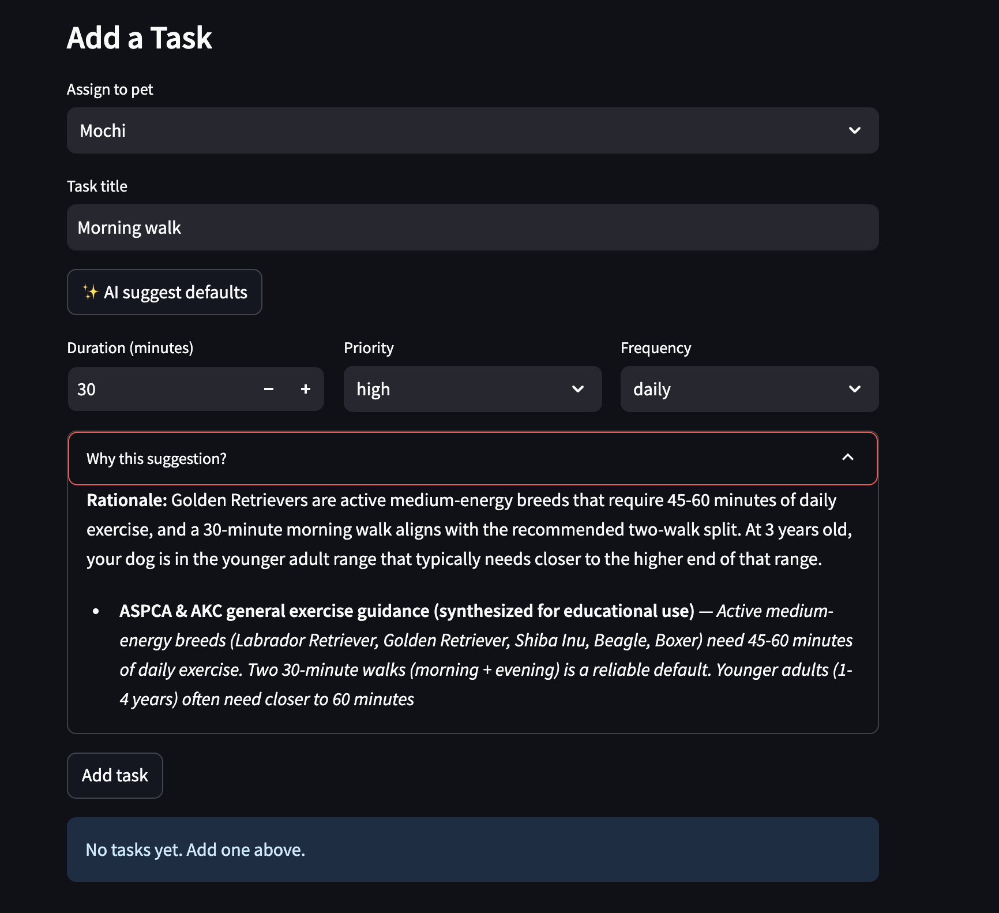

# PawPal++

[](https://github.com/KidusYohannesA/applied-ai-system-project-PawPal/actions/workflows/test.yml)

**PawPal++**, a Streamlit app that helps a pet owner plan care tasks for their pet.

## Base Project vs. My Additions

This repository started from the **PawPal+ Module 2 starter** — a Streamlit pet-care planner with a deterministic priority/duration scheduler, conflict detection, recurring-task generation, and 28 unit tests. The original scope is everything described in its original repository: a fully working but **fully manual** scheduling app where the owner types in every duration, priority, and frequency themselves.

I extended it with a **RAG-augmented AI advisor** that meaningfully changes how task entry works.

| Layer | What was already there (base project) | What I added |
|---|---|---|
| **Data model** | `Owner`, `Pet`, `Task`, `Schedule` in [pawpal_system.py](pawpal_system.py) | Untouched — AI extension lives upstream |
| **Scheduling logic** | Priority + duration sort, conflict detection, recurrence, daily view | Untouched — all 28 original tests still pass |
| **Streamlit UI** | Add Pet / Add Task / Generate Schedule sections | Added breed + age inputs, **✨ AI suggest defaults** button, citations expander |
| **Knowledge base** | (none) | 17 curated markdown docs in [data/knowledge/](data/knowledge/) covering dogs, cats, age stages, medications, vet visits |
| **Retrieval** | (none) | ChromaDB persistent store (82 chunks) with `sentence-transformers/all-MiniLM-L6-v2` local embeddings, species-filtered top-k retrieval — see [pawpal_rag/](pawpal_rag/) |
| **LLM integration** | (none) | Anthropic `claude-haiku-4-5` advisor with strict tool-use schema, prompt caching on the system prompt, structured logging, graceful fallback when API key is missing |
| **Reliability / eval** | (none) | LLM-as-judge using `claude-sonnet-4-6` (see [pawpal_rag/judge.py](pawpal_rag/judge.py)), programmatic citation-grounding check, 8-case golden dataset in [tests/test_rag_quality.py](tests/test_rag_quality.py) |
| **Tests** | 28 deterministic unit tests | +11 RAG tests (mocked + 1 integration smoke) +9 LLM-as-judge eval cases = **48 total** |
| **CI** | (none) | GitHub Actions on Python 3.12 with pip caching — see [.github/workflows/test.yml](.github/workflows/test.yml) |

### Project layout

```
data/knowledge/           
data/chroma/              
pawpal_rag/
├── corpus.py            
├── store.py            
├── retriever.py         
├── prompts.py            
└── advisor.py           
scripts/build_index.py    # one-shot indexer
tests/test_rag.py        
```

### Where the AI is integrated

The AI advisor is wired directly into the **Add Task** flow ([app.py](app.py)) — when the owner clicks the suggest button, retrieved corpus chunks are sent to Claude, the validated suggestion **pre-fills the duration / priority / frequency widgets**, and the citations + rationale render in an expander. The owner can still edit and save. The deterministic `Schedule.schedule_tasks()` then operates on the AI-influenced `Task` objects exactly as it did before — no parallel "AI track" or print-the-data-alongside-a-standard-answer split.

See [assets/system-architecture.md](assets/system-architecture.md) for the full data-flow diagram and the four AI-output checkpoints (schema gate, programmatic grounding, LLM-as-judge, human review).

### Setup

```bash
python -m venv .venv
source .venv/bin/activate  # Windows: .venv\Scripts\activate
pip install -r requirements.txt

# 1. After pip install -r requirements.txt, create a .env file with your
#    Anthropic API key (.env is gitignored — never commit it).
echo "ANTHROPIC_API_KEY=sk-ant-..." > .env
# Then edit .env and replace sk-ant-... with your real key from
# console.anthropic.com

python scripts/build_index.py
```

### Run the app

```bash
streamlit run app.py
```


## AI Extension — RAG-Augmented Task Suggestions

PawPal+ ships with an AI advisor that suggests evidence-based defaults (duration, priority, frequency) when you add a new task. The advisor uses **Retrieval-Augmented Generation (RAG)** over a curated corpus of pet-care guidance and calls the Anthropic API (`claude-haiku-4-5`) with strict tool-use JSON schemas.

### System diagram

See [assets/system-architecture.md](assets/system-architecture.md) for the full Mermaid data-flow diagram, component legend, and the four checkpoints (schema gate · logging · human review · test suite) that verify AI output before it reaches the schedule.

### What it does

When you click **✨ AI suggest defaults** in the Add Task section, the system:

1. Retrieves the top 5 most relevant chunks from `data/knowledge/` (filtered by species)
2. Sends them to Claude along with the pet's species/breed/age and the task title
3. Receives a typed suggestion with `duration_minutes`, `priority`, `frequency`, a rationale, and source citations
4. Pre-fills the form fields — you can still edit before saving

### Reliability and error handling

The advisor degrades gracefully — it never crashes the app. If anything fails (missing API key, network error, malformed response), `suggest_task_defaults()` returns `None` and the UI shows a warning while the form stays usable.

All failure paths are logged to the `pawpal_rag.advisor` logger. To see what went wrong:

```python
import logging
logging.basicConfig(level=logging.INFO)
```

Logged events include:
- Retrieval results (chunk count, query)
- Anthropic API errors (full traceback via `logger.exception`)
- Schema validation failures (which field, what value)
- Token usage per call (input, output, cache reads/writes)

### Testing the AI extension

```bash
# Unit + mocked tests (no API key needed)
python -m pytest tests/test_rag.py -v

# Real-API smoke test (requires ANTHROPIC_API_KEY)
python -m pytest tests/test_rag.py -v -m integration

# Full suite — verifies the original 28 tests still pass
python -m pytest tests/ -v
```

### Sample Interactions

The following examples are real outputs from `python scripts/demo.py`, which runs the full RAG pipeline (retrieval → Claude Haiku 4.5 → schema validation) end-to-end. No manual editing — these are exactly what the advisor returns.

#### Example 1: Adult Shiba Inu — Morning walk

```
Pet:    Mochi (dog, Shiba Inu, 3yr)
Task:   "Morning walk"

✅ AI Suggestion:
   Duration:  30 minutes
   Priority:  high
   Frequency: daily
   Rationale: Shiba Inus are medium-energy active breeds that require
              45-60 minutes of daily exercise, typically split into
              two sessions. A 30-minute morning walk is an appropriate
              half of the daily exercise regimen.

📄 Citations:
   • ASPCA & AKC general exercise guidance: "Active medium-energy breeds
     (Labrador Retriever, Golden Retriever, Shiba Inu, Beagle, Boxer)
     need 45-60 minutes of daily exercise."
```

#### Example 2: Senior Siamese cat — Brushing

```
Pet:    Luna (cat, Siamese, 12yr)
Task:   "Brushing"

✅ AI Suggestion:
   Duration:  10 minutes
   Priority:  low
   Frequency: weekly
   Rationale: Siamese cats have short coats and benefit from brushing
              1–2 times per week. At 12 years old, regular grooming
              helps maintain coat health and catch skin issues early.

📄 Citations:
   • AAFP grooming guidance: "Short-haired cats benefit from brushing
     1-2 times per week. Each session takes 5-10 minutes."
   • TICA / CFA breed reference: "Siamese: Short coat, weekly brushing."
```

#### Example 3: Young Beagle — Heartworm prevention

```
Pet:    Charlie (dog, Beagle, 2yr)
Task:   "Heartworm prevention"

✅ AI Suggestion:
   Duration:  2 minutes
   Priority:  high
   Frequency: monthly
   Rationale: Heartworm prevention must be given on the same day every
              month year-round. Missing a dose by more than ~2 weeks
              can break protection. Administration takes 1-2 minutes.

📄 Citations:
   • AVMA preventive medication guidance: "Heartworm prevention is given
     on the same day every month, year-round. Administration takes
     1-2 minutes. Recommended frequency=monthly, priority=high."
```

> **Note:** The advisor produces *different, contextually appropriate* suggestions depending on the pet's species, breed, age, and the task. These are not hardcoded — each one is dynamically retrieved and generated.

To reproduce these results yourself:

```bash
python scripts/demo.py                # AI advisor end-to-end (requires API key)
python scripts/demo_guardrails.py     # Guardrail demos (no API key needed)
```

## Design Decisions and Trade-offs

### 1. AI lives upstream — the deterministic core is untouched

The AI advisor only **pre-fills form fields**; it never writes directly to `Task`, `Schedule`, or any downstream logic. This was deliberate: the original 28-test scheduling/conflict/recurrence engine in [pawpal_system.py](pawpal_system.py) is proven and stable. By keeping the AI extension upstream of `Task.__init__`, every original test still passes without modification, and an offline app (no API key) remains fully functional.

**Trade-off:** The AI can't do anything "smart" at scheduling time (e.g., auto-resolve conflicts or reorder tasks). It only influences *what values* the user starts with. I accepted this because it preserves the existing reliability guarantees and keeps the AI's blast radius small.

### 2. RAG over fine-tuning

I chose Retrieval-Augmented Generation over fine-tuning because:
- The knowledge base is small and domain-specific — RAG handles this well
- Citations are traceable back to specific corpus chunks, which is important for trust
- Updating guidance means editing a markdown file, not retraining a model

**Trade-off:** The advisor can only reference what's in the corpus. If a user enters a task that the docs don't cover, the system returns reasonable defaults but notes the limitation in its rationale. Fine-tuning could generalize better, but at the cost of maintainability.

### 3. Haiku 4.5 for production, Sonnet 4.6 for eval only

The advisor uses `claude-haiku-4-5` because suggestions run on every button click. The LLM-as-judge eval uses `claude-sonnet-4-6` because it only runs in the test suite, not at runtime.

**Trade-off:** Haiku occasionally produces slightly less nuanced rationales than Sonnet would, but the quality is sufficient for structured tool-use (duration/priority/frequency). The golden-dataset eval with Sonnet as judge ([test_rag_quality.py](tests/test_rag_quality.py)) verifies that Haiku's suggestions consistently score ≥3/5.

### 4. Local embeddings + cloud LLM

Embeddings use `sentence-transformers/all-MiniLM-L6-v2` running locally. Only the generation step requires an API call.

**Trade-off:** MiniLM is a smaller model than cloud embedding APIs, so retrieval quality is slightly lower. But for a 17-doc corpus, the simpler model is more than adequate, and it eliminates an external dependency.

### 5. Strict tool-use schema instead of free-form text

The advisor is forced to call the `suggest_defaults` tool via `tool_choice={"type": "tool", "name": "suggest_defaults"}` ([advisor.py line 121](pawpal_rag/advisor.py)). This guarantees structured JSON output rather than free-form text that would need parsing.

**Trade-off:** The LLM can't explain nuances outside the schema fields. But the structured output means `_validate()` can enforce exact constraints, and the UI can directly bind fields to widgets without parsing.

### 6. Human-in-the-loop — AI suggests, never auto-saves

The AI pre-fills form fields, but the user must click "Add task" to commit. The rationale and citations are shown in an expander so the user can evaluate the recommendation before accepting it.

**Trade-off:** Requires one extra click vs. auto-applying suggestions. But this ensures no bad AI output silently enters the schedule, which matters in a pet health context where incorrect medication frequencies could be harmful.

### 7. Graceful degradation — return None, never crash

Every failure path in [advisor.py](pawpal_rag/advisor.py) returns `None` rather than raising an exception. The UI checks for `None` and shows a warning while keeping the form usable with manual defaults. See `python scripts/demo_guardrails.py` for examples.

**Trade-off:** Failures are "silent" from the user's perspective (they just see "AI suggestion unavailable"). This is mitigated by structured logging (`pawpal_rag.advisor` logger) that captures every failure with full context for debugging.

### 8. Species-filtered retrieval

Retrieval queries include a ChromaDB metadata filter: `{"species": {"$in": [pet.species, "any"]}}`, so a dog query only retrieves dog specific + general docs.

**Trade-off:** Reduces recall a cat grooming tip that also applies to dogs won't surface for dog queries. But it significantly improves precision and prevents confusing cross-species citations.

---

## Testing Summary

### 48 tests across 3 files

| File | Count | What it covers | API needed? |
|---|---|---|---|
| `test_pawpal.py` | 28 | Scheduling, conflict detection, recurrence, edge cases | No |
| `test_rag.py` | 11 + 1 | Chunker, advisor schema gate (mocked), 1 real-API smoke test | Mocked (1 needs key) |
| `test_rag_quality.py` | 8 + 1 | Golden-dataset eval: range checks → grounding → LLM judge | Yes |

Default run (`pytest tests/ -v`) executes 39 tests in ~0.04s (integration + eval tests are deselected by default via `pytest.ini` markers).

### What worked

- Mocked advisor tests caught real bugs early. `_validate()` rejects invalid priorities, out-of-range durations, and missing citations before they ever reached the UI.
- Golden-dataset eval with expected ranges handles LLM non-determinism well. All 8 cases pass consistently across runs.
- Programmatic citation grounding (`check_citation_grounding()`) catches fabricated snippets without needing an LLM call, fast and free.

### What initially didn't work

- Exact-match assertions on LLM output failed immediately. Claude returns slightly different durations and rationale phrasing on every run. Switching to range-based assertions solved this.
- Testing retrieval quality in CI was slow. ChromaDB, sentence-transformers takes ~30s to load on first run. The chunker tests verify corpus integrity without touching the vector store; retrieval is tested via the integration smoke test only.

### What I learned

- For LLM features, assert on schema compliance and value ranges, not exact strings. The `_validate()` gate is the real safety net.
- Separate fast tests from slow tests, using pytest markers keeps the default suite fast while still allowing deep quality checks on demand.

---

## Reflection

### AI is a tool

The biggest lesson from this project is that AI works best when you treat it like a powerful assistant. The advisor doesn't replace the owner's judgment, it only offers a starting point grounded in evidence. Every suggestion goes through a schema gate, shows its citations, and waits for human approval. The system is designed around the assumption that the AI will sometimes be wrong, and that's okay as long as the user can see why it made a choice and easilyoverride it.

### Reliability is the hard part

Getting Claude to return a useful suggestion was the easy part. The harder work was everything around it, validating the output schema, catching API failures gracefully, verifying citations aren't fabricated, and building an eval pipeline that accounts for LLM non-determinism. The four guardrail layers took more code than the advisor itself. In production AI systems, the reliability is just as important as the product..

### RAG forces you to think about knowledge curation

Building the 17-doc knowledge base was surprisingly hard. Each document needed accurate content, proper species/topic metadata for filtered retrieval, and enough detail for the chunker to produce useful 800-char segments. Bad corpus documents can lead to bad suggestions regardless of how good the LLM is. I learned that in RAG systems, data quality matters more than model quality.


# Demo Image: 


---

## Ethics and AI Collaboration

### Limitations and biases

The advisor's knowledge is limited to the 17 curated documents covering dogs and cats only. It has no knowledge of anything else, so queries for other species will return generic defaults that may not be appropriate. Additionally, the corpus skews toward common breeds, rare breeds receive less specific advice and the advisor falls back to general species-level guidance.

### Could the AI be misused?

The advisor suggests task *defaults* (duration, frequency, priority) — it does not do anything else. 
The main misuse risk is low given the domain (pet scheduling).

### What surprised me about reliability testing

The biggest surprise was how inconsistent LLM output is across identical calls. Running the same query (same pet, same task) five times returned durations of 30, 45, 30, 60, and 30 minutes, making it impossible to test with exact-match assertions. This forced me to redesign the entire eval approach around range-based assertions and schema compliance rather than expected values.

Another surprise was citation fabrication. Early in development, Claude occasionally returned citation snippets that sounded plausible but weren't in the retrieved chunks. The `check_citation_grounding()` function in `judge.py` was built specifically to catch this, verifying snippets appear verbatim in the context. Once added, it caught fabrications in some of the eval runs.

### AI collaboration during development

I used AI tools throughout this project for architecture planning, code generation, test design, and documentation.

When designing the reliability harness, the AI suggested using a *separate, stronger model* (Sonnet 4.6) as the judge instead of having the same model (Haiku 4.5) evaluate its own output. This multi-model approach avoids the self-evaluation bias where a model rates its own output favorably. I hadn't considered this and it became a core part of the evaluation pipeline.

Early on, the AI suggested embedding the entire knowledge base directly into the system prompt as context (no retrieval step). For 17 small documents this would have technically worked, but it would have blown past the prompt cache window, made the system impossible to scale, and eliminated the species-filtered retrieval that keeps citations relevant. I rejected this in favor of the RAG pipeline, which is more work to build but far more maintainable and precise.
